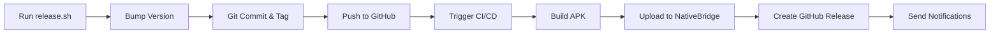

# CI/CD & NativeBridge Integration Documentation

Welcome to the NativeBridge CI/CD documentation! This directory contains all the guides you need to understand and use the automated build and deployment pipeline.

## 📚 Documentation Files

### 🚀 Quick Start

**[QUICKSTART_CICD.md](../QUICKSTART_CICD.md)** - Start here!
- Quick overview of the release process
- How to create releases with one command
- Testing and troubleshooting tips
- **Perfect for:** First-time users

### 🔧 NativeBridge Integration

**[NATIVEBRIDGE_CICD.md](NATIVEBRIDGE_CICD.md)** - Project-specific guide
- How NativeBridge is integrated into THIS project
- Setup instructions for GitHub Secrets
- Configuration options
- Troubleshooting specific to this pipeline
- **Perfect for:** Team members working on this project

**[NATIVEBRIDGE_API_INTEGRATION.md](NATIVEBRIDGE_API_INTEGRATION.md)** - General guide
- Integrate NativeBridge into ANY CI/CD platform
- Examples for 8+ platforms (GitHub Actions, Jenkins, GitLab, etc.)
- Reusable code snippets
- Best practices
- **Perfect for:** Using NativeBridge in other projects

### 📖 Reference Documentation

**[application_upload_api.md](workflows/application_upload_api.md)** - Complete API reference
- Full API documentation
- All parameters explained
- Response formats
- Example scenarios
- **Perfect for:** Deep dive into the API

**[SECRETS_SETUP.md](SECRETS_SETUP.md)** - GitHub Secrets guide
- How to configure secrets
- Security best practices
- Production vs development setup
- **Perfect for:** Setting up GitHub Secrets

### 📋 Release Documentation

**[RELEASE_AUTOMATION.md](../RELEASE_AUTOMATION.md)** - Release script guide
- How the `release.sh` script works
- Usage examples
- Troubleshooting
- **Perfect for:** Understanding the release process

---

## 🎯 What is NativeBridge?

**NativeBridge** is a revolutionary cloud platform that lets you **run Android apps instantly in your browser** without any installation:

### Key Features

- ☁️ **Cloud Emulators** - Test on virtual Android devices instantly in your browser
- 📱 **Real Physical Devices** - Run on actual Android hardware in the cloud
- 🚀 **One-Click Launch** - No setup, no downloads, just click and test
- 🌐 **Universal Access** - Works on Windows, Mac, Linux, even mobile browsers
- 🔗 **Shareable Magic Links** - Send links to anyone for instant testing
- 🎮 **Auto-Start Sessions** - Automatically start test sessions after upload
- 📧 **Email Notifications** - Automatic notifications when new versions are uploaded
- 💬 **Slack Integration** - Get notified in Slack when sessions are ready
- 🔒 **Access Control** - Public or private apps with user allowlists

### How It Works

1. **Upload APK** via API (automated in CI/CD)
2. **Get Magic Link** instantly
3. **Share Link** with your team
4. **Run App** in cloud emulator or real device
5. **Test Anywhere** - no installation required!

---

## 🚀 Quick Setup Guide

### Step 1: Get NativeBridge API Key

1. Log in to [NativeBridge](https://nativebridge.io)
2. Go to **API Keys**: https://nativebridge.io/dashboard/api-keys
3. Click **Generate New API Key** or **Create API Key**
4. Copy the API key

### Step 2: Add to GitHub Secrets

1. Go to your repository → **Settings** → **Secrets and variables** → **Actions**
2. Click **New repository secret**
3. Add:
   - **Name:** `NATIVEBRIDGE_API_KEY`
   - **Value:** Your API key from Step 1
4. Click **Add secret**

### Step 3: (Optional) Add Slack Webhook

For session notifications:

1. Create a Slack incoming webhook at https://api.slack.com/messaging/webhooks
2. Go to **Settings** → **Secrets and variables** → **Actions**
3. Add:
   - **Name:** `SLACK_WEBHOOK_URL`
   - **Value:** Your Slack webhook URL

### Step 4: Create a Release

```bash
# Basic release
./scripts/release.sh 1.0.0

# With auto-start session
./scripts/release.sh 1.0.0 --start-session

# Custom session settings
./scripts/release.sh 1.0.0 --start-session \
  --device-id your-device-id \
  --session-validity 180
```

That's it! The pipeline will:
- ✅ Build your APK
- ✅ Upload to NativeBridge
- ✅ Generate magic link for cloud testing
- ✅ **[NEW]** Auto-start test session (if `--start-session` used)
- ✅ **[NEW]** Send Slack notification (if configured)
- ✅ Create GitHub Release with session URL
- ✅ Send email notifications

---

## 📂 File Structure

```
.github/
├── workflows/
│   ├── release-build.yml          # Main CI/CD workflow
│   └── application_upload_api.md  # Complete API documentation
│
├── NATIVEBRIDGE_CICD.md          # Project integration guide
├── NATIVEBRIDGE_API_INTEGRATION.md # General CI/CD guide
├── SECRETS_SETUP.md              # GitHub Secrets setup
└── README.md                      # This file

scripts/
├── release.sh                     # Automated release script
└── README.md                      # Release script documentation

QUICKSTART_CICD.md                 # Quick start guide
RELEASE_AUTOMATION.md              # Release automation guide
BUILD_GUIDE.md                     # Build instructions
```

---

## 🔄 Workflow Overview

### Release Process



### What Happens Automatically

1. **Version Bumping**
   - Updates `package.json`
   - Updates `android/app/build.gradle`
   - Creates git commit

2. **Git Operations**
   - Creates annotated tag
   - Pushes to GitHub
   - Triggers workflow

3. **Build Process**
   - Sets up environment
   - Generates/decodes keystore
   - Builds signed APK
   - Fixes Kotlin compilation issues

4. **NativeBridge Upload**
   - Uploads APK via API
   - Parses response
   - Extracts magic links and app ID
   - Saves for later steps

5. **Session Start** (Optional)
   - Starts test session on NativeBridge device
   - Uses device ID and validity from tag
   - Generates session URL
   - Sends Slack notification (if configured)

6. **GitHub Release**
   - Downloads APK artifact
   - Creates release
   - Includes NativeBridge cloud link
   - Includes active session URL (if started)
   - Attaches APK file

7. **Notifications**
   - Email via NativeBridge (if enabled)
   - Slack via webhook (if session started)
   - GitHub notifications
   - Build summaries with session info

---

## 🔑 Required Secrets

### Minimum Setup

| Secret | Required | Description |
|--------|----------|-------------|
| `NATIVEBRIDGE_API_KEY` | **Yes** | API key for NativeBridge uploads |

### Production Setup (Recommended)

| Secret | Required | Description |
|--------|----------|-------------|
| `NATIVEBRIDGE_API_KEY` | **Yes** | API key for NativeBridge uploads |
| `ANDROID_KEYSTORE_BASE64` | No | Base64-encoded release keystore |
| `ANDROID_KEYSTORE_PASSWORD` | No | Keystore password |
| `ANDROID_KEY_ALIAS` | No | Key alias in keystore |
| `ANDROID_KEY_PASSWORD` | No | Key password |

### Optional: Session & Notifications

| Secret | Required | Description |
|--------|----------|-------------|
| `SLACK_WEBHOOK_URL` | No | Slack webhook for session notifications |

> **Note:** If keystore secrets are not provided, the workflow generates a temporary keystore for CI builds.

---

## 📝 Usage Examples

### Create Release (Standard)

```bash
# Bump to version 1.0.0 and create release
./scripts/release.sh 1.0.0
```

### Create Release with Auto-Session

```bash
# Release with automatic session start (2 min default)
./scripts/release.sh 1.0.0 --start-session

# Custom session duration (3 minutes)
./scripts/release.sh 1.0.0 --start-session --session-validity 180

# Specific device with custom duration
./scripts/release.sh 1.0.0 --start-session \
  --device-id 67a642531a4aa535498192f8 \
  --session-validity 240

# Quick 30-second smoke test
./scripts/release.sh 1.0.0 --start-session --session-validity 30
```

### Session Parameters

| Parameter | Description | Default | Valid Range |
|-----------|-------------|---------|-------------|
| `--start-session` | Enable auto-start session | disabled | - |
| `--device-id <id>` | NativeBridge device ID | `67a642531a4aa535498192f8` | Any valid ID |
| `--session-validity <s>` | Session duration (seconds) | `120` | 30-300 |

### Dry Run (Test Without Pushing)

```bash
# See what would happen without actually releasing
./scripts/release.sh 1.0.0 --dry-run

# Test with session options
./scripts/release.sh 1.0.0 --start-session --dry-run
```

### npm Scripts

```bash
# Standard release
npm run release 1.0.0

# Dry run
npm run release:dry 1.0.0
```

### Manual Build

```bash
# Build debug APK locally
cd android && ./gradlew assembleDebug

# Build release APK locally
cd android && ./gradlew assembleRelease
```

---

## 🎯 Common Use Cases

### Testing Internally

```yaml
# Make app private for internal testing
-F "accessType=private" \
-F "allowedUsers=dev@company.com" \
-F "allowedUsers=qa@company.com"
```

### QA Team Notifications

```yaml
# Send notifications to QA team
-F "sendNotification=true" \
-F "notificationEmails=qa@company.com" \
-F "notificationEmails=product@company.com"
```

### Staging vs Production

```yaml
# Create separate app entry for staging
-F "versionAction=create_new_app"
```

---

## 🔧 Troubleshooting

### API Key Issues

**Problem:** "NATIVEBRIDGE_API_KEY secret not configured"

**Solution:**
1. Verify secret is added to GitHub Secrets
2. Check secret name is exactly `NATIVEBRIDGE_API_KEY`
3. Re-run the workflow

### Build Failures

**Problem:** Kotlin compilation errors

**Solution:**
- Workflow includes automatic patches
- If still fails, check Android Gradle plugin compatibility
- Review workflow logs for specific errors

### Upload Failures

**Problem:** API returns 401 Unauthorized

**Solution:**
1. Verify API key is correct
2. Check for extra spaces/newlines in secret
3. Regenerate API key if needed

**Problem:** API returns 429 Rate Limit

**Solution:**
- Wait 60 seconds before retrying
- NativeBridge allows 10 requests/minute

---

## 📖 Learn More

### NativeBridge Resources

- **Website:** https://nativebridge.io
- **Dashboard:** https://nativebridge.io/dashboard
- **API Keys:** https://nativebridge.io/dashboard/api-keys
- **Documentation:** https://docs.nativebridge.io

### CI/CD Resources

- **GitHub Actions Docs:** https://docs.github.com/actions
- **This Project's Workflow:** [workflows/release-build.yml](workflows/release-build.yml)
- **Quick Start:** [QUICKSTART_CICD.md](../QUICKSTART_CICD.md)

---

## 🤝 Support

### Project-Specific Issues

- Check [NATIVEBRIDGE_CICD.md](NATIVEBRIDGE_CICD.md) troubleshooting section
- Review GitHub Actions logs
- Check this README

### NativeBridge API Issues

- Read [workflows/application_upload_api.md](workflows/application_upload_api.md)
- Contact: api-support@nativebridge.io
- Dashboard: https://nativebridge.io/dashboard

### General Integration Help

- See [NATIVEBRIDGE_API_INTEGRATION.md](NATIVEBRIDGE_API_INTEGRATION.md)
- Examples for your CI/CD platform
- Best practices guide

---

## ✨ Benefits of This Setup

### For Developers

- ✅ **One Command Release** - `./scripts/release.sh 1.0.0`
- ✅ **Automatic Versioning** - No manual file editing
- ✅ **Signed APKs** - Production-ready builds
- ✅ **Cloud Testing** - Test without installing

### For QA Teams

- ✅ **Instant Access** - Click magic link to test
- ✅ **No Installation** - Run in browser
- ✅ **Real Devices** - Test on actual hardware
- ✅ **Email Notifications** - Know when new versions are ready

### For Product Managers

- ✅ **Easy Sharing** - Send links to stakeholders
- ✅ **Version History** - All versions accessible
- ✅ **Quick Demos** - No setup for demonstrations
- ✅ **Cross-Platform** - Share with anyone, any device

---

## 🎮 Auto-Start Session Feature

### Overview

The pipeline can automatically start test sessions on **one or more NativeBridge devices** after uploading your Android app. This is controlled via **command-line parameters** when creating a release.

**New in v1.3.0**: Support for **multiple sessions** on different devices using comma-separated device IDs.

> 💡 **Need Device IDs?** See [How to Get Device IDs](#how-to-get-device-ids) section below to find available devices using the NativeBridge API.

### How It Works

1. Run release script with `--start-session` flag
2. Session config is embedded in git tag message
3. CI/CD workflow parses the config from tag
4. After APK upload, session API is called
5. Session URL is generated and included in release

### Usage

```bash
# Enable session with defaults
./scripts/release.sh 1.0.0 --start-session

# Customize device and duration
./scripts/release.sh 1.0.0 --start-session \
  --device-id your-device-id \
  --session-validity 180
```

### Parameters

- `--start-session` - Enable automatic session start
- `--device-id <ids>` - Device ID(s) - single or comma-separated for multiple (default: `67a642531a4aa535498192f8`)
- `--session-validity <seconds>` - Duration in seconds (default: 120, range: 30-300)

**Examples:**
```bash
# Single device
--device-id 682dba7233c7787633294734

# Multiple devices (starts 3 sessions)
--device-id 682dba7233c7787633294734,685bf304ec144f98463c221d,69581275499de2e1a23c44f9
```

### Session Info Location

When a session is started, you'll find the URL in:
- ✅ GitHub Actions summary (under "🚀 Active Session")
- ✅ GitHub Release notes (under "🎮 Active Session")
- ✅ Slack notification (if webhook configured)

### Slack Notifications

To receive Slack notifications when sessions start:

1. Create webhook at https://api.slack.com/messaging/webhooks
2. Add `SLACK_WEBHOOK_URL` to GitHub Secrets
3. Use `--start-session` when creating release

You'll receive a formatted message with:
- App version and session ID
- Device ID and validity
- Clickable session URL
- Link to GitHub Actions workflow

### Use Cases

**Quick smoke test (30 seconds):**
```bash
./scripts/release.sh 1.0.1 --start-session --session-validity 30
```

**Standard testing (2 minutes):**
```bash
./scripts/release.sh 1.0.1 --start-session
```

**Extended manual testing (5 minutes):**
```bash
./scripts/release.sh 1.0.1 --start-session --session-validity 300
```

**Specific test device:**
```bash
./scripts/release.sh 1.0.1 --start-session --device-id abc123
```

### API Details

The session is created using the NativeBridge Session API:
- **Endpoint:** `POST /v1/device/session`
- **Parameters:** deviceType, deviceId, appId, region, executionValidity
- **Response:** sessionId, sessionUrl

For complete API documentation, see [NATIVEBRIDGE_API_INTEGRATION.md](NATIVEBRIDGE_API_INTEGRATION.md#session-api).

---

## 🧪 Beta Build Feature

### Overview

The pipeline supports building **two variants simultaneously** - production and beta builds. This allows you to:
- Upload both production and beta apps to NativeBridge in a single trigger
- Start sessions on TWO different devices (one for prod, one for beta)
- Test both variants in parallel
- Get separate magic links and session URLs for each variant

### How It Works

1. Run release script with `--beta` flag
2. Beta configuration is embedded in git tag message
3. CI/CD workflow builds/copies BOTH variants:
   - Production: `NativeBridge-v1.0.0.apk`
   - Beta: `NativeBridge-v1.0.0-beta.apk`
4. Both APKs are uploaded to NativeBridge
5. Sessions are started on separate devices (if `--start-session` is used)
6. Both variants are included in GitHub Release

### Usage

```bash
# Basic beta + production build
./scripts/release.sh 1.0.0 --beta

# Beta build with single session on each variant
./scripts/release.sh 1.0.0 --beta --start-session \
  --device-id prod-device-id \
  --beta-device-id beta-device-id

# MULTIPLE SESSIONS: 1 prod session + 2 beta sessions
./scripts/release.sh 1.0.0 --beta --start-session \
  --device-id 682dba7233c7787633294734 \
  --beta-device-id 67a6424f1a4aa535498192f7,67a642531a4aa535498192f8

# MULTIPLE SESSIONS: 2 prod sessions + 2 beta sessions
./scripts/release.sh 1.0.0 --beta --start-session \
  --device-id dev1-id,dev2-id \
  --beta-device-id beta-dev1-id,beta-dev2-id \
  --session-validity 240

# Production only with 3 sessions on different devices
./scripts/release.sh 1.0.0 --start-session \
  --device-id device1,device2,device3
```

### Multiple Sessions Feature

**New in v1.3.0**: You can now start sessions on **multiple devices** by providing comma-separated device IDs.

**Examples:**
- `--device-id dev1,dev2` - Starts 2 production sessions
- `--beta-device-id beta1,beta2,beta3` - Starts 3 beta sessions
- Mix and match: 1 prod + 2 beta, or 3 prod + 1 beta, etc.

**Use Cases:**
- Test on multiple Android versions simultaneously
- QA team: parallel testing on different devices
- Region testing: different device configurations
- Performance comparison across devices

### How to Get Device IDs

To find available devices for testing, use the NativeBridge Devices API:

**API Endpoint:**
```bash
curl -X 'GET' \
  'https://api.nativebridge.io/v1/devices?device_type=android&emulated=false' \
  -H 'accept: application/json' \
  -H 'X-Api-Key: YOUR_API_KEY'
```

**Response Example:**
```json
{
  "data": [
    {
      "id": "682dba7233c7787633294734",
      "type": "android",
      "osVersion": "14",
      "modelName": "Samsung Galaxy S22 Ultra",
      "isEmulator": false,
      "deviceOwner": "shared",
      "userPlan": "all"
    },
    {
      "id": "685bf304ec144f98463c221d",
      "type": "android",
      "osVersion": "13",
      "modelName": "Pixel 5",
      "isEmulator": false,
      "deviceOwner": "shared",
      "userPlan": "free"
    },
    {
      "id": "68d153469457da61a16488b9",
      "type": "android",
      "osVersion": "15",
      "modelName": "Motorola G05",
      "isEmulator": false,
      "deviceOwner": "aspora.com",
      "userPlan": "free"
    },
    {
      "id": "69581275499de2e1a23c44f9",
      "type": "android",
      "osVersion": "14",
      "modelName": "Xiaomi Poco C75",
      "isEmulator": false,
      "deviceOwner": "shared",
      "userPlan": "free"
    },
    {
      "id": "695a9249f6a40ebd23e29565",
      "type": "android",
      "osVersion": "13",
      "modelName": "Realme 3 Pro",
      "isEmulator": false,
      "deviceOwner": "shared",
      "userPlan": "free"
    }
  ]
}
```

**Understanding the Response Fields:**

- `id` - **Device ID** (use this in `--device-id` parameter)
- `type` - Device platform (`android` or `ios`)
- `osVersion` - Operating system version (e.g., "13", "14", "15")
- `modelName` - Device model (e.g., "Samsung Galaxy S22 Ultra", "Pixel 5")
- `isEmulator` - `true` for virtual devices, `false` for real physical devices
- `deviceOwner` - **Important:**
  - `"shared"` - Public device available to all users
  - `"aspora.com"`, `"example.com"`, etc. - **Dedicated device** reserved for specific organization (uses domain part of company email)
- `userPlan` - Access level (`"free"`, `"all"`, etc.)

**Query Parameters:**
- `device_type` - Filter by device type (`android` or `ios`)
- `emulated` - Filter by emulator status (`true` for emulators, `false` for real devices)

**How to Use Device IDs:**

1. **List available devices:**
   ```bash
   curl -X GET 'https://api.nativebridge.io/v1/devices?device_type=android&emulated=false' \
     -H 'X-Api-Key: YOUR_API_KEY'
   ```

2. **Copy device IDs from the response** (the `id` field)

3. **Use them in your release:**
   ```bash
   # Single device
   ./scripts/release.sh 1.0.0 --start-session \
     --device-id 682dba7233c7787633294734

   # Multiple devices (comma-separated)
   ./scripts/release.sh 1.0.0 --start-session \
     --device-id 682dba7233c7787633294734,685bf304ec144f98463c221d,69581275499de2e1a23c44f9
   ```

**Selecting Devices by Criteria:**

- **Test on different Android versions:**
  - Android 15: `68d153469457da61a16488b9` (Motorola G05) - **Dedicated to aspora.com**
  - Android 14: `682dba7233c7787633294734` (Samsung S22 Ultra) - Shared
  - Android 13: `685bf304ec144f98463c221d` (Pixel 5) - Shared

- **Test on different manufacturers:**
  - Samsung: `682dba7233c7787633294734` (Shared)
  - Google Pixel: `685bf304ec144f98463c221d` (Shared)
  - Motorola: `68d153469457da61a16488b9` (Dedicated to aspora.com)
  - Xiaomi: `69581275499de2e1a23c44f9` (Shared)
  - Realme: `695a9249f6a40ebd23e29565` (Shared)

- **Device Ownership:**
  - **Shared Devices** (`deviceOwner: "shared"`): Available to all users, may have queue times
  - **Dedicated Devices** (`deviceOwner: "aspora.com"`, `"yourcompany.com"`, etc.): Reserved for specific organization (matches email domain), typically faster access

**Example - Cross-Version Testing:**
```bash
# Test on Android 13, 14, and 15 simultaneously
# Using shared devices for broader compatibility testing
./scripts/release.sh 1.0.0 --start-session \
  --device-id 695a9249f6a40ebd23e29565,682dba7233c7787633294734,685bf304ec144f98463c221d
```

**Example - Using Dedicated Devices:**
```bash
# If you have dedicated devices (deviceOwner matches your organization)
# These typically provide faster, exclusive access
./scripts/release.sh 1.0.0 --start-session \
  --device-id 68d153469457da61a16488b9
```

**💡 Pro Tips:**

1. **Shared vs Dedicated Devices:**
   - Use **shared devices** for general testing and CI/CD pipelines
   - Use **dedicated devices** (when available) for critical releases or performance testing
   - Check the `deviceOwner` field - if it matches your email domain (e.g., user@**aspora.com** → `deviceOwner: "aspora.com"`), you have priority access to that device

2. **Choosing Multiple Devices:**
   - Mix shared and dedicated devices for cost-effective testing
   - Example: `--device-id dedicated-device,shared-device1,shared-device2`

3. **Filter Dedicated Devices:**
   ```bash
   # Get all your organization's dedicated devices (replace with your email domain)
   # Example: if your email is john@aspora.com, search for "aspora.com"
   curl -X GET 'https://api.nativebridge.io/v1/devices?device_type=android&emulated=false' \
     -H 'X-Api-Key: YOUR_API_KEY' | grep -A 6 '"deviceOwner": "aspora.com"'
   ```

### Parameters

- `--beta` - Enable beta build (builds both production and beta)
- `--device-id <ids>` - Device IDs for production sessions (comma-separated for multiple)
- `--beta-device-id <ids>` - Device IDs for beta sessions (comma-separated for multiple, defaults to production device IDs)

### Pre-built APK Approach

**Important:** This workflow uses **pre-built APKs** instead of building from source. This approach:
- ✅ Completes in ~30 seconds (vs 8-10 minutes for actual builds)
- ✅ Enables fast testing of NativeBridge integration
- ✅ Avoids CI resource exhaustion
- ✅ Still provides full cloud testing capabilities

**Pre-built APK Locations:**
- Production: `builds/NativeBridge-Production.apk`
- Beta: `builds/NativeBridge-Beta.apk`

### Building Your Own Beta Variant

To create a beta variant APK with a different package name:

```bash
# 1. Update package name in android/app/build.gradle
android {
    defaultConfig {
        applicationId "com.yourapp.beta"  // Different from production
    }
}

# 2. Build the APK
cd android && ./gradlew assembleRelease

# 3. Copy to builds folder
cp app/build/outputs/apk/release/app-release.apk \
   ../../builds/NativeBridge-Beta.apk

# 4. Commit the pre-built APK
git add ../../builds/NativeBridge-Beta.apk
git commit -m "Update pre-built beta APK"
```

### Building Multiple Variants with Gradle

For actual multi-variant builds, use Product Flavors:

```gradle
android {
    flavorDimensions "version"
    productFlavors {
        production {
            dimension "version"
            applicationId "com.yourapp"
            versionNameSuffix ""
        }
        beta {
            dimension "version"
            applicationId "com.yourapp.beta"
            versionNameSuffix "-beta"
        }
    }
}
```

Build both:
```bash
# Build production
./gradlew assembleProductionRelease

# Build beta
./gradlew assembleBetaRelease

# Copy to builds folder
cp app/build/outputs/apk/production/release/app-production-release.apk \
   ../../builds/NativeBridge-Production.apk
cp app/build/outputs/apk/beta/release/app-beta-release.apk \
   ../../builds/NativeBridge-Beta.apk
```

### What Gets Created

When you use `--beta`, the pipeline creates:

**Artifacts:**
- `NativeBridge-v1.0.0.apk` - Production APK
- `NativeBridge-v1.0.0-beta.apk` - Beta APK
- `NativeBridge-iOS-v1.0.0.app.zip` - iOS app (unchanged)

**NativeBridge Uploads:**
- Production app with magic link and versioned link
- Beta app with separate magic link and versioned link

**Sessions** (if `--start-session` used):
- Multiple production sessions (one per device ID in `--device-id`)
- Multiple beta sessions (one per device ID in `--beta-device-id`)
- Example: `--device-id d1,d2 --beta-device-id b1,b2,b3` creates 2 prod + 3 beta sessions

**Slack Notifications** (if configured):
- Production session notification
- Beta session notification (separate message)

### Use Cases

**Testing new features before production:**
```bash
# Beta includes experimental features, production is stable
./scripts/release.sh 1.5.0 --beta --start-session \
  --device-id stable-device \
  --beta-device-id test-device
```

**Different backend environments:**
```bash
# Production points to prod API, beta points to staging API
./scripts/release.sh 2.0.0 --beta --start-session
```

**QA testing on multiple devices:**
```bash
# QA team testing on 3 devices per variant (6 sessions total!)
./scripts/release.sh 1.2.3 --beta --start-session \
  --device-id qa-android10,qa-android11,qa-android12 \
  --beta-device-id qa-tablet1,qa-tablet2,qa-phone1 \
  --session-validity 300
```

**Load testing / Performance comparison:**
```bash
# Test production on 5 different device configurations
./scripts/release.sh 1.3.0 --start-session \
  --device-id low-end,mid-range,high-end,tablet,foldable
```

### Where to Find Beta Links

After release, you'll find beta variant info in:

**GitHub Release Notes:**
- "🧪 Android (Beta): Launch Beta in NativeBridge Cloud" link
- "🧪 Active Session - Beta" section with session URL
- Download link for `NativeBridge-v1.0.0-beta.apk`

**GitHub Actions Summary:**
- "🧪 NativeBridge Upload - Beta" section
- "🧪 Active Session - Beta" section

**Slack Notification:**
- Separate "🧪 NativeBridge Beta Session Started" message

### Backward Compatibility

The beta feature is **fully backward compatible**:
- Without `--beta` flag, only production build is created (works exactly as before)
- Existing releases continue to work without changes
- Beta is opt-in via command-line flag

---

## 🎓 Getting Started Checklist

### Basic Setup
- [ ] Read [QUICKSTART_CICD.md](../QUICKSTART_CICD.md)
- [ ] Get NativeBridge API key from https://nativebridge.io/dashboard/api-keys
- [ ] Add `NATIVEBRIDGE_API_KEY` to GitHub Secrets
- [ ] Run `./scripts/release.sh 1.0.0 --dry-run` to test
- [ ] Create first release: `./scripts/release.sh 1.0.0`
- [ ] Check GitHub Actions for build status
- [ ] Test magic link in GitHub Release
- [ ] Share with team!

### Advanced: Auto-Session Setup
- [ ] (Optional) Create Slack incoming webhook
- [ ] (Optional) Add `SLACK_WEBHOOK_URL` to GitHub Secrets
- [ ] Test session with: `./scripts/release.sh 1.0.1 --start-session --dry-run`
- [ ] Create release with session: `./scripts/release.sh 1.0.1 --start-session`
- [ ] Check session URL in GitHub Release
- [ ] Verify Slack notification (if configured)

### Advanced: Beta Build Setup
- [ ] Build your beta variant APK with different package name
- [ ] Save beta APK to `builds/NativeBridge-Beta.apk`
- [ ] Commit the pre-built beta APK to repository
- [ ] Test beta build: `./scripts/release.sh 1.0.2 --beta --dry-run`
- [ ] Create release with beta: `./scripts/release.sh 1.0.2 --beta`
- [ ] Verify both APKs in GitHub Release
- [ ] Test both magic links (production and beta)
- [ ] (Optional) Test with sessions: `./scripts/release.sh 1.0.3 --beta --start-session --beta-device-id <id>`

---

**Last Updated:** 2026-01-13
**Version:** 1.0
**Workflow File:** `workflows/release-build.yml`
